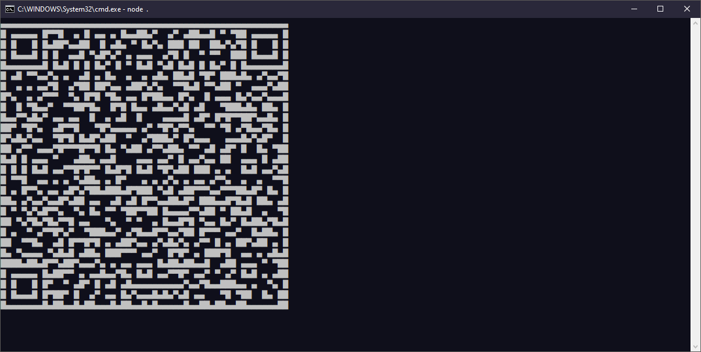
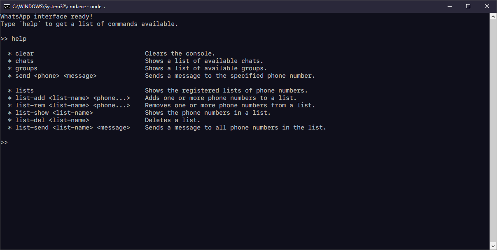

# Instalación

Para instalar esta herramienta, simplemente ejecuta el siguiente comando con npm (o con [pnpm](https://pnpm.io/) que es nuestro favorito!) para instalar todas las dependencias del paquete:

```
npm install
```

Luego, ejecuta el proyecto utilizando el siguiente comando:

```
node .
```

Eso es todo. Espera unos segundos para que la interfaz se cargue. La primera vez deberás escanear un código QR con tu WhatsApp desde tu móvil para permitir que la interfaz se comunique con tu cuenta. Esto es seguro y siempre puedes revocar el acceso desde tu dispositivo móvil en cualquier momento si asi lo deseas.




Una vez que la interfaz haya cargado y este conectada con Whatsapp puedes escribir `help` y presionar enter para ver los comandos disponibles.



<br/>

# Casos de Uso
A continuación te damos los casos de uso más comunes.

### Crear una lista con múltiples números de teléfono:

Puedes crear una lista con cualquier nombre (i.e. `Lista1`) y añadir cuantos teléfonos desees. Si se te olvidó alguno puedes volver a ejecutar el comando con el teléfono que te hace falta.

```
list-add Lista1 3321XXXX 9467XXXX 3345XXXX 3198XXXX ...
```

### Enviar un mensaje a todos los números de teléfono en una lista:
```
list-send Lista1 Hola! Esta es otra prueba :)
```

### Enviar un mensaje a un número de teléfono:
```
send 3321XXXX Hola! Esta es una prueba.
```
